# Spring Boot JPA

### 一. 创建SrpingBoot项目

#### 1. 通过IDEA创建Boot项目(File->New->Project) 

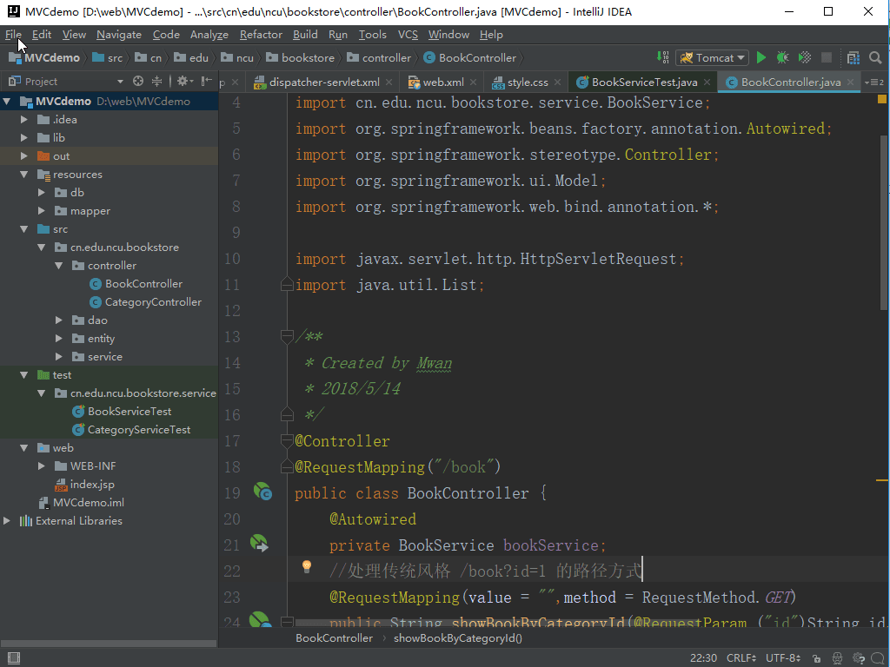

#### 2. 选择需要的依赖：web、jpa、mysql

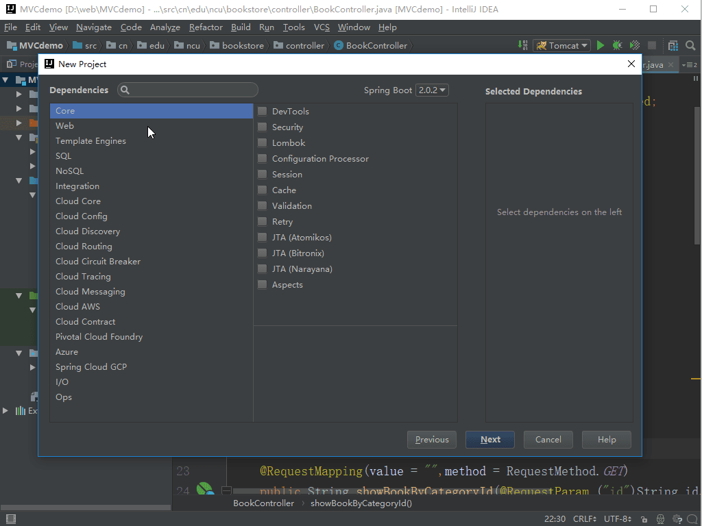

> 默认官网的源速度感人，可替换为阿里的源，使用附件中的setting文件。
>
> 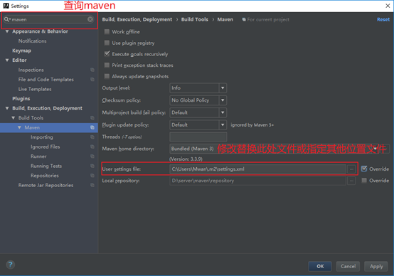

#### 3. 未使用IDEA或MyEclipse 等IDE的同学，可以通过官方网站创建项目

- 打开URL： start.spring.io，同样输入项目相关信息及所需的依赖

  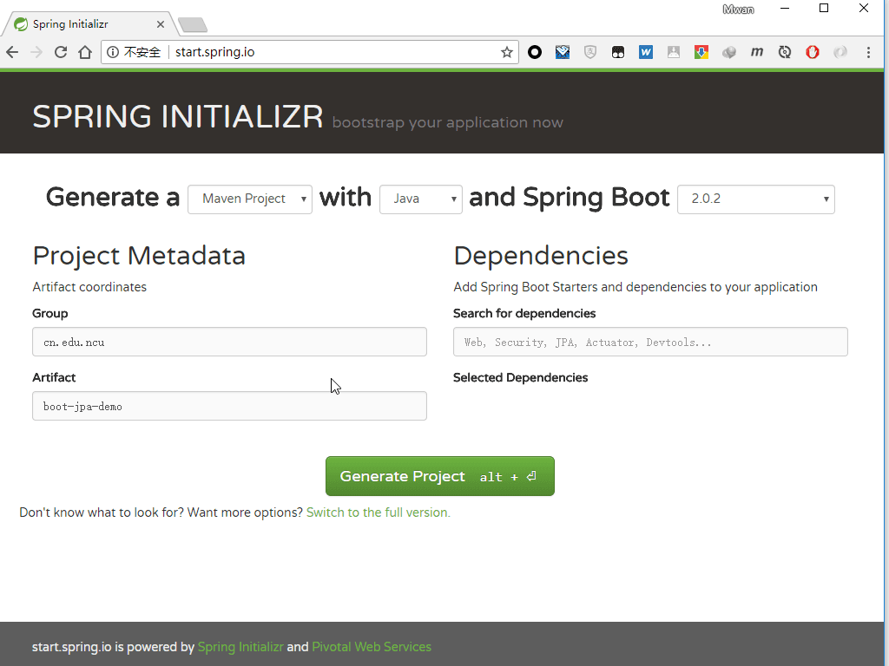

- 下载解压后通过Maven方式导入（由于项目为Maven项目，所以必须已经安装Maven环境）

  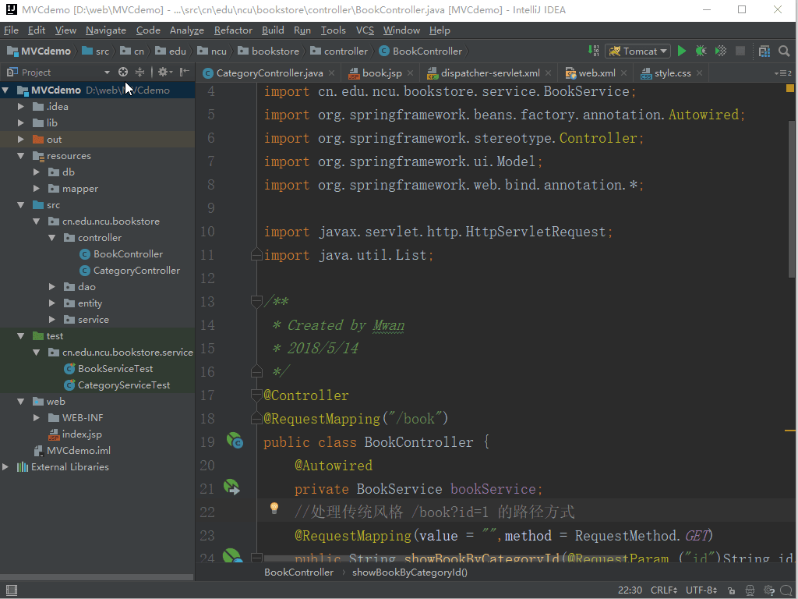

### 4. 进行项目相关配置

- 修改配置文件类型为yml（可选）

  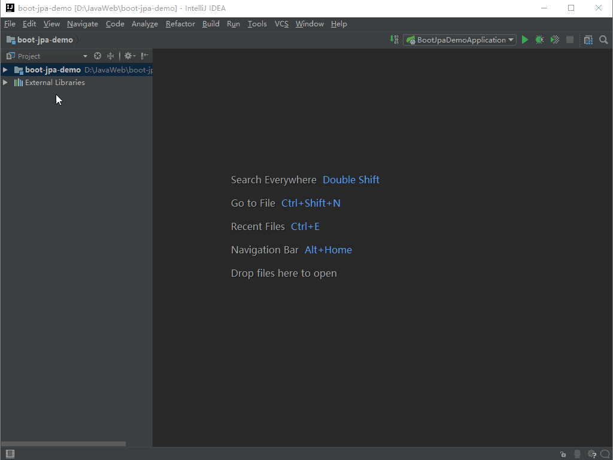

- 配置项目相关信息：数据库连接信息、JPA SQL语句输出、日志打印级别；也可以在这设置项目端口、路径等

  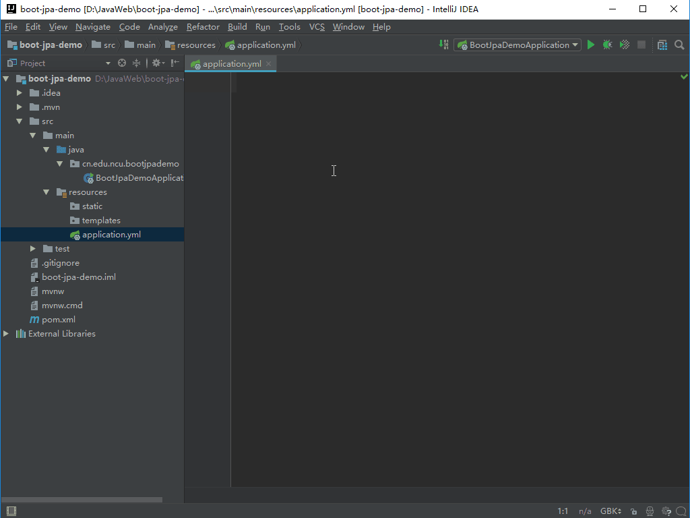

```yaml
spring:
  datasource:
    driver-class-name: com.mysql.jdbc.Driver
    username: root
    password: root
    url: jdbc:mysql://localhost:3306/book?useSSL=false
  jpa:
    show-sql: true
logging:
  level:
    cn.edu.ncu.bootjpademo: debug
```

jpa.show-sql: true 运行时输出SQL，方便进行调试。

logging.level 可以指定不同包的日志输出级别。

### 二. 编码实现

#### 1. 创建相应的package：entity、dao、service、controller

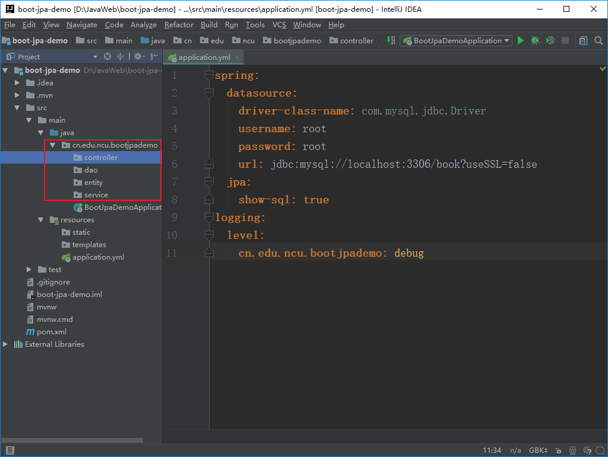

#### 2. 书籍分类查询功能

- 按照表结构创建分类entity，并通过idea自动生成getter、setter及toString方法

  - 类标记注解为@Entity，并在主键（@Id）和自增字段（@GeneratedValue）上添加相应的注解

  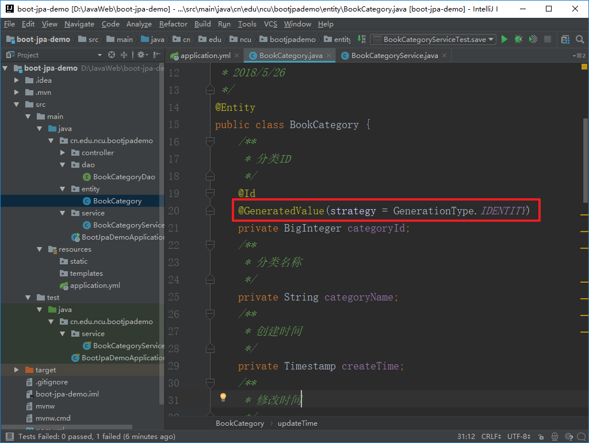

- 创建dao接口，接口类 extends JpaRepository<T,ID>，T和ID分别为相应的实体和主键类型

  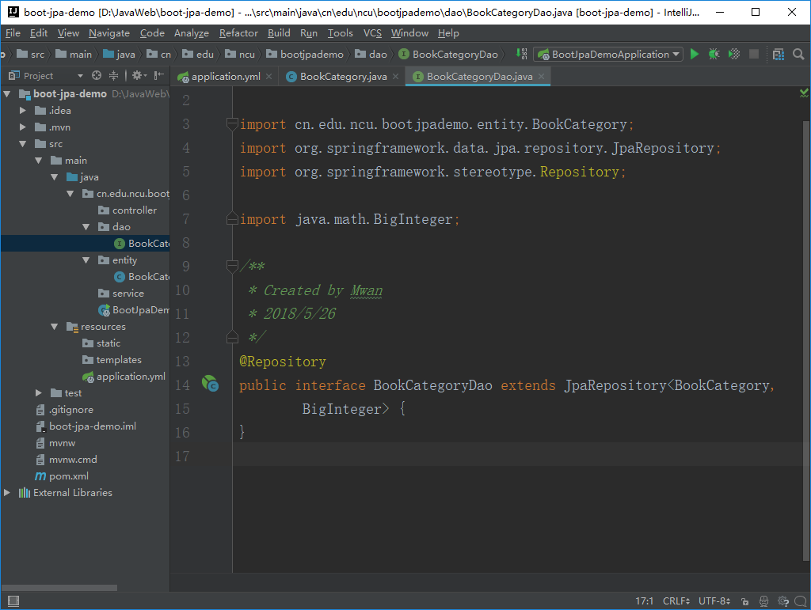

- 创建相应的service

  ~~~ Java
  @Service
  public class BookCategoryService {
      @Autowired
      private BookCategoryDao bookCategoryDao;
      /**
      @description 查询所有分类信息
      @param
      @return  List<BookCategory>
      */
      public List<BookCategory> findAll(){
          return bookCategoryDao.findAll();
      }
  }
  ~~~

  

- 创建service的单元测试方法
  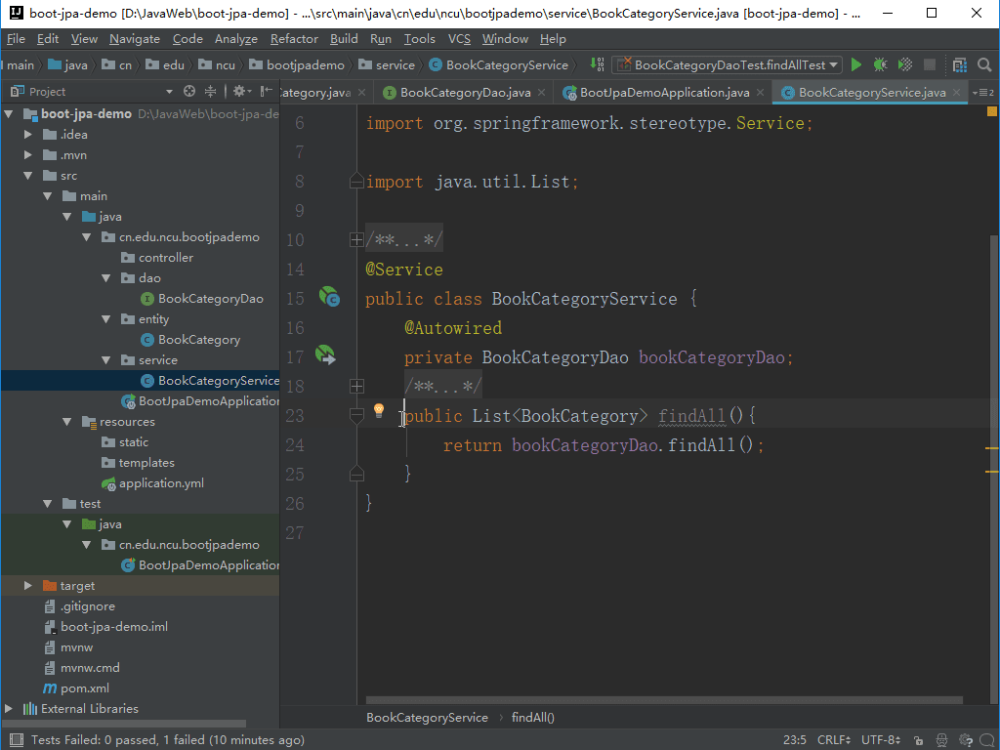

```java
@RunWith(SpringRunner.class)
@SpringBootTest
public class BookCategoryServiceTest {
    private final Logger logger =
            LoggerFactory.getLogger(this.getClass());
    @Autowired
    private BookCategoryService service;
    @Test
    public void findAll() {
        logger.debug(service.findAll().toString());
    }
}
```
  - 运行测试方法，观察日志输入是否正常（可先在数据库表中添加测试数据）

  - 创建controller类（**BookCategoryController**）及方法（**findAl**l）

    ```java
    @RestController
    @RequestMapping(value = "category")
    public class BookCategoryController {
        @Autowired
        private BookCategoryService service;
        /**
        @Description 获取全部分类信息
        @Param
        @Return List<BookCategory>
        */
        @RequestMapping(value = "",method = RequestMethod.GET)
        public List<BookCategory> findAll(){
            return service.findAll();
        }
    }
    ```

- 运行整个项目，并使用postman访问（get方法也可以通过浏览器访问）

  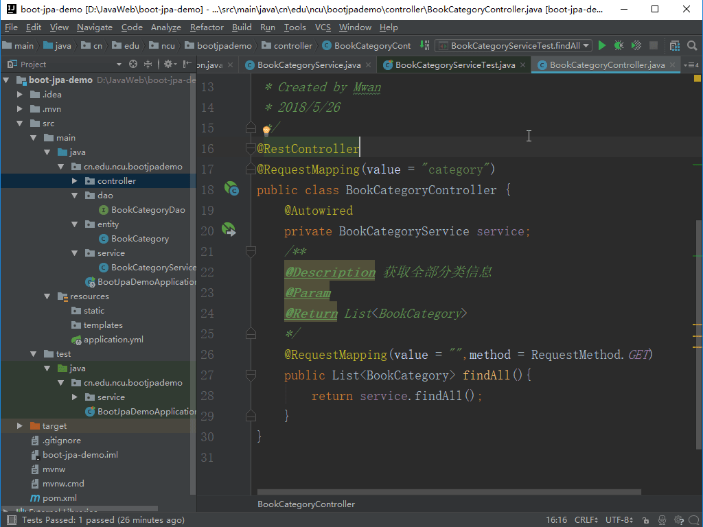

  Postman获取方式：(https://www.getpostman.com/ 或者 添加chrome插件方式获取)

  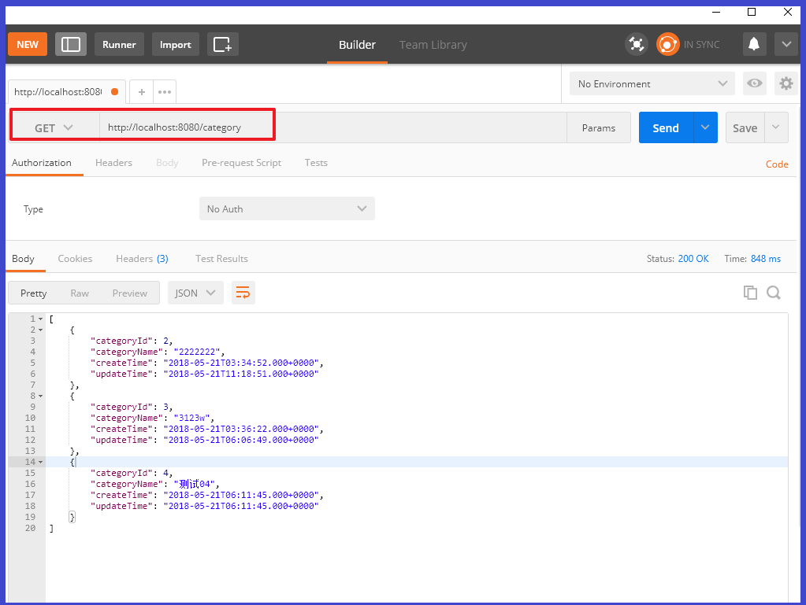

#### 3.insert功能

 - 简单的CRUD功能JPA已经提供，不需要手工完成dao的实现类

- dao不用修改，直接在service（**BookServiceService**）中添加插入功能（**saveBookCategory**）

  ~~~Java
      /**
      @description 添加书籍分类信息
      @param bookCategory
      @return
      */
      public void saveBookCategory(BookCategory bookCategory) {
          bookCategoryDao.save(bookCategory);
      }
  ~~~

- 创建测试方法

  - 因为JPA是懒加载，所以需要在测试类上加上注解@Transactional

  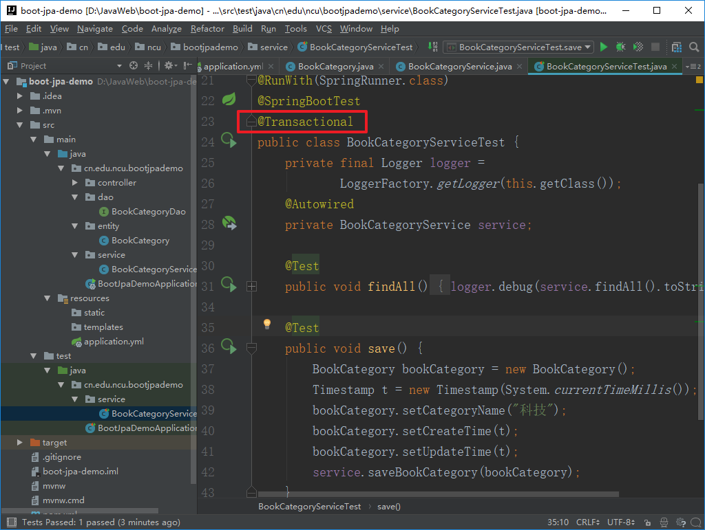

  ~~~Java
  @Test
  public void save() {
      BookCategory bookCategory = new BookCategory();
      Timestamp t = new Timestamp(System.currentTimeMillis());
      bookCategory.setCategoryName("科技");
      bookCategory.setCreateTime(t);
      bookCategory.setUpdateTime(t);
      service.saveBookCategory(bookCategory);
  }
  ~~~

  

- 执行测试，查看结果（由于添加@Transactional 之后在测试类中并不会commit，所以数据库中不会有新增记录）

- 添加contorller方法

  ~~~Java
      /**
      @description 通过POST获取数据，并添加分类信息
      @param bookCategory
      @return
      */
      @PostMapping("")
      public void saveBookCategory(BookCategory bookCategory){
          service.saveBookCategory(bookCategory);
      }
  ~~~

  使用@PostMapping 等于 @RequestMapping(value,method = RequestMethod.POST)

- 启动项目，并使用Postman进行测试

  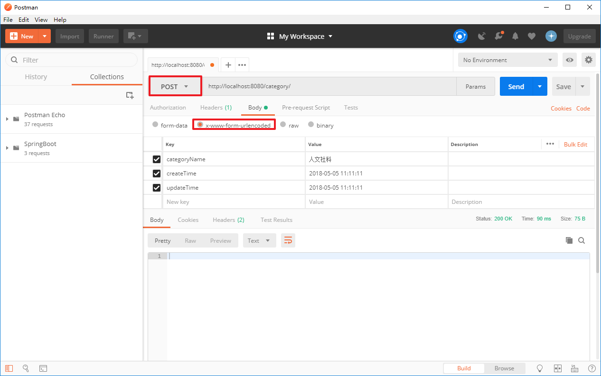

  > 时间格式为：yyyy-mm-dd hh:mm:ss

  查看数据库中数据，并观察控制台的输出。

  **思考题：JPA如何将post中的数据存入数据库的？**

  **自己动手完成删除、更新功能**

### 三. 手动映射及SQL

#### 1. 表和字段

- 建立一个非驼峰风格表

  ~~~sql
  CREATE TABLE `book` (
    `id` varchar(40) NOT NULL,
    `name` varchar(100) NOT NULL,
    `author` varchar(100) NOT NULL,
    PRIMARY KEY (`id`))
  ~~~

- 建立entity（记得生成getter、setter方法）

~~~Java
@Entity
@Table(name = "book")
public class Book {
    @Id
    @Column(name = "id")
    private String id;

    @Column(name = "name")
    private String name;

    @Column(name = "author")
    private String author;
}
~~~

- 创建dao

~~~Java
@Repository
public interface BookDao extends JpaRepository<Book,String>{
    @Query(value = "select * from book where id < ?",nativeQuery = true)
    List<Book> queryBook(String id);
}
~~~

- 创建service

~~~Java
@Service
public class BookService {
    @Autowired
    private BookDao dao;

    public List<Book> queryBook(String id){
        return dao.queryBook(id);
    }
}
~~~

- 进行单元测试，观察输出结果是否正确。

**自己创建controller类及相应方法，并使用Postman或浏览器访问路径，并打印结果**

### 四. 文件上传

#### 1. 建立上传文件夹

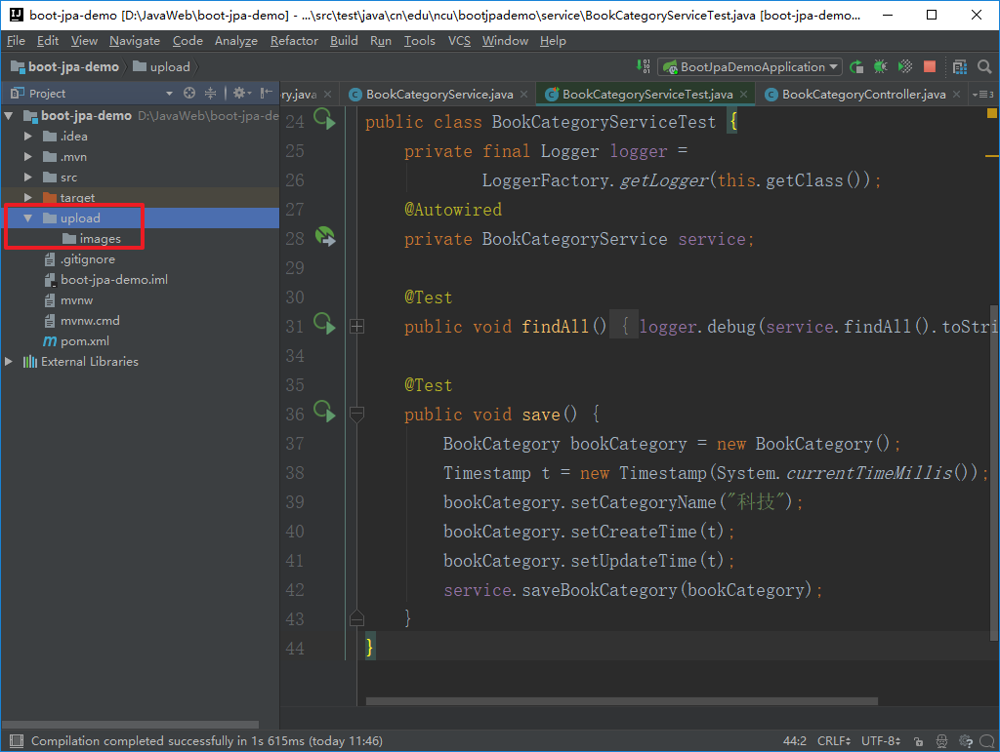

建立 upload/images 文件夹

#### 2. 在controller package下创建 UploadFileController类

~~~Java
@RestController
@RequestMapping("/file")
public class UploadFileController {
    
    @PostMapping("/images")
    public String singleFileUpload(@RequestParam("file") MultipartFile file) {
        if (file.isEmpty()) {
            return "请选择上传文件";
        }
        try {            
            byte[] bytes = file.getBytes();
            Path path = Paths.get("upload/images/"+file.getOriginalFilename());
            Files.write(path, bytes);
        } catch (IOException e) {
            e.printStackTrace();
        }
        return "上传成功";
    }
}
~~~

#### 3. 启动项目，使用Postman进行测试

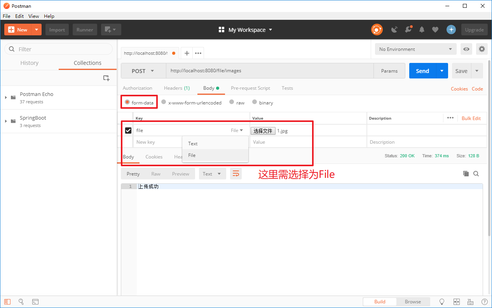

URL：http://localhost:8080/file/images 

#### 4. 也可以启动Nginx或Apache等Web服务器，编写html页面进行测试（也可以直接打开）

~~~html
<!DOCTYPE html>
<html>
<head>
	<meta charset="UTF-8">
</head>
<body>
<h1>Spring Boot file upload example</h1>
<form method="POST" action="http://localhost:8080/file/images" enctype="multipart/form-data" accept-charset="UTF-8">
    <input type="file" name="file" /><br/><br/>
    <input type="submit" value="Submit" />
</form>
</body>
</html>
~~~

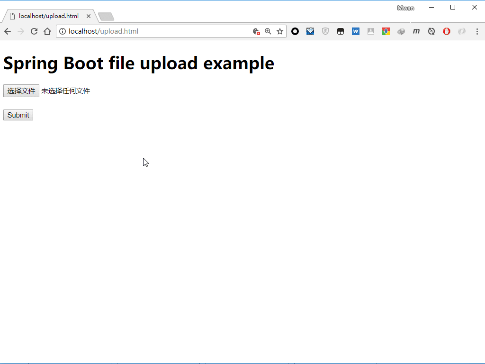

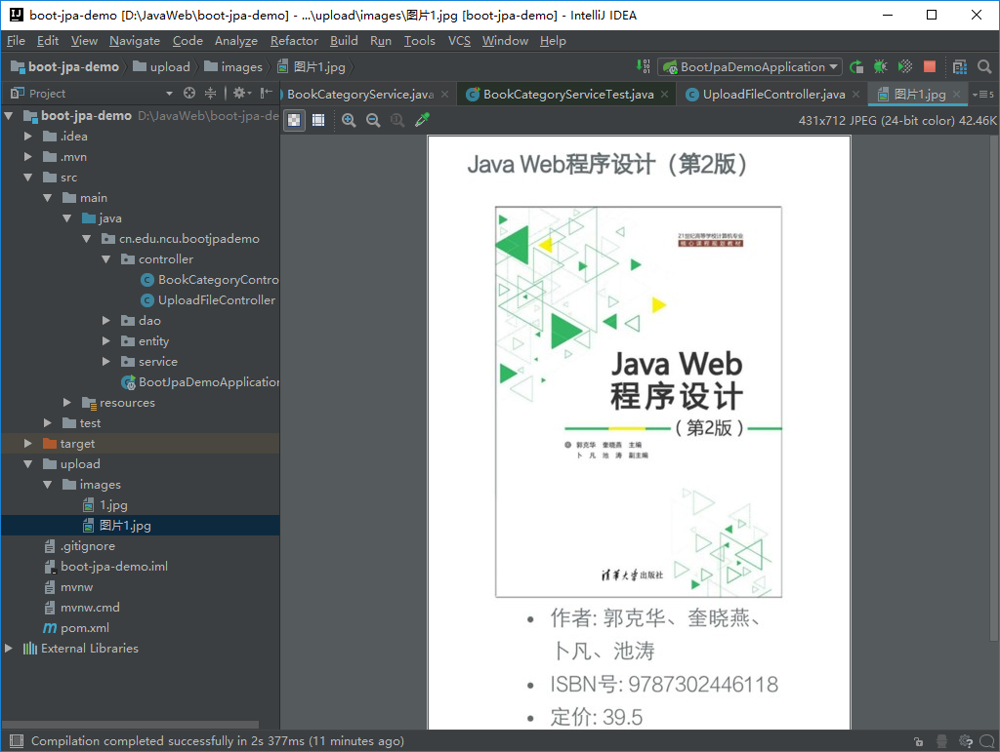